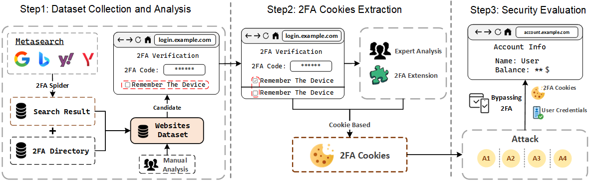

# SE2FA - Website 2FA Security Evaluation Framework

SE2FA is a framework designed for evaluating the security of website 2FA systems. This repository contains the code for two important components that make up the SE2FA framework:

## Components

### 1. **2FA Spider**
The 2FA Spider is a crawler that uses a meta search engine to discover websites that support 2FA, including relevant 2FA documentation. It helps in automatically identifying and cataloging websites with 2FA implementations for further security assessment. If you want to run this program, please read the README.md in 2FA Spider Directory.

### 2. **2FA Extension**
The 2FA Extension is a Google Chrome plugin that accelerates the extraction of 2FA cookies. It offers the following functionalities:
- Capture cookie snapshots
- Compare two cookie snapshots
- Intercept and capture HTTP traffic

## Framework Architecture
The SE2FA framework consists of these two components working in tandem to assess the security of websites' 2FA mechanisms. Below is an architecture diagram illustrating how the components interact:

